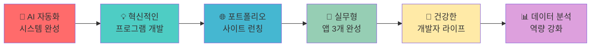

# 👋 안녕하세요! 저는 준철입니다!

<div align="center">
  


<!-- Typing Animation -->
<p align="center">
  
</p>

<!-- Profile Views Counter -->


</div>

## 🚀 About Me


- 💼 **본업:** 영업, 기획, 기술지원 전문가 (25년 경력)
- 🔭 **현재 집중분야**: AI 기반 개발 자동화 & 데이터 시각화
- 💻 **기술 스택**: JavaScript, HTML, CSS, Python, React, Node.js
- 🧠 **관심분야**: AI 자동화, 풀스택 개발, 데이터 분석
- 💬 **전문 영역**: 웹사이트 자동화, AI 자동화, 프로젝트 관리
- 📫 연락처: **GitHub Issues나 Discussions 활용해주세요!**
- ⚡ 재미있는 사실: **개발에 열정적인 만큼 건강도 챙기고 있습니다** 🌿
- 🤖 **AI와 자동화로 더 나은 세상을 만들어가고 싶습니다!**

<br clear="both"/>

## 💻 기술 스택 & 도구

<div align="center">

### 🚀 프론트엔드 기술


### ⚙️ 백엔드 & 데이터베이스


### 🤖 AI & 자동화


### 🛠️ 개발 도구 & 플랫폼


</div>

## 🔥 최신 프로젝트 하이라이트

<div align="center">

### 🚀 DevFlow-AI-Pro
> **전문적인 AI 기반 개발 어시스턴트**
> 
> 🏗 **Features:**
> - ⚡ 실시간 코드 분석 및 최적화
> - 🔗 GitHub 통합 워크플로우
> - ✅ 자동화된 개발 프로세스  
> - 🎯 프로덕션 레디 아키텍처
> - 🔧 워크플로우 최적화 도구

[](https://github.com/junetapa-juncheol/DevFlow-AI-Pro)

### 📊 Korea Cancer Statistics 2020
> **2020년 한국 암 발생 통계 분석 & 시각화**
> 
> 💡 **목표:** 국립암센터 공식 데이터 기반 인터랙티브 대시보드로 건강 정보 접근성 향상

[](https://github.com/junetapa-juncheol/junetapa-juncheol-korea-cancer-statistics-2020)

### 🎨 Frontend Learning Journey
> **30일 프론트엔드 학습 여정**
> 
> 🌟 **특징:** 체계적인 학습 구조, 인터랙티브 예제, 실무 팁 포함

[](https://github.com/junetapa-juncheol/CSS-Fundamentals-Day2)

### 🤖 AI Chatbot Project
> **한국어 지원 AI 챗봇 웹 애플리케이션**
> 
> 🌟 **특징:** 자연스러운 대화, 반응형 디자인, 다양한 기능 통합

[](https://github.com/junetapa-juncheol/chatbot-project-junetapa)

</div>

## 📊 GitHub 통계 & 성과

<div align="center">

<table>
  <tr>
    <td width="50%">
      
    </td>
    <td width="50%">
      
    </td>
  </tr>
  <tr>
    <td colspan="2">
      
    </td>
  </tr>
</table>

</div>

## 🏆 GitHub 트로피 & 성취 배지

<div align="center">

[](https://github.com/ryo-ma/github-profile-trophy)

</div>

## 💪 개발자의 건강한 하루

<div align="center">

🎯 건강을 챙기면서도 열정적으로 개발하는 라이프스타일!

```text
🌱 건강 관리      ████████░░ 80%
💻 코딩 시간      ████████░░ 8시간/일
🤖 AI 학습       ███████░░░ 70%
🚀 프로젝트 진행률  ████████░░ 80%
🧘 워라밸        ██████░░░░ 60%
☕ 커피 섭취     ██░░░░░░░░ 건강상 조절 중 😅
```

</div>

## 📈 개발 활동 그래프

<div align="center">

[](https://github.com/ashutosh00710/github-readme-activity-graph)

</div>

## 🎯 2025년 목표 로드맵

<div align="center">



</div>

## 💭 개발 철학

<div align="center">
  
> *"AI는 인간을 대체하는 것이 아니라, 인간의 능력을 확장시키는 도구가 되어야 한다"*
> 
> *"코드 한 줄, 한 줄이 모두 세상을 더 나은 곳으로 만들어가는 도구이다"* 🌟
> 
> *"건강한 몸과 마음이 최고의 개발 환경이다"* 🌿


</div>

## 🌟 주목할 만한 프로젝트들

<div align="center">

| 프로젝트 | 설명 | 기술 스택 | 상태 |
|---------|------|-----------|------|
| 🎯 **DevFlow-AI-Pro** | 전문적인 개발 자동화 도구 |   |  |
| 📊 **Cancer Statistics** | 공익적 데이터 시각화 프로젝트 |   |  |
| 🤖 **AI Chatbot** | 한국어 지원 지능형 챗봇 |   |  |
| 🎨 **Frontend Journey** | 30일 학습 시리즈 |   |  |
| ☕ **Coffee Guide** | 커피 정보 가이드 사이트 |  |  |
| 🔧 **Node.js Framework** | 백엔드 개발 프레임워크 |   |  |

</div>

## 🤝 함께 소통해요!

<div align="center">

[](mailto:jun22sky@nate.com)
[](https://github.com/junetapa-juncheol)
[](https://discord.gg/junetapa)

<!-- GitHub 후원하기 버튼 (후원 설정 완료 후 활성화) -->
<!-- [](https://github.com/sponsors/junetapa-juncheol) -->

### 💡 빠른 연락 방법
- 🐛 **버그 제보**: [Issues 탭](https://github.com/junetapa-juncheol/junetapa-juncheol/issues) 이용
- 💬 **질문 & 토론**: [Discussions 탭](https://github.com/junetapa-juncheol/junetapa-juncheol/discussions) 활용
- 🤝 **협업 제안**: Issues나 이메일로 연락

</div>

## 📈 실시간 코딩 통계

<div align="center">

<!--START_SECTION:waka-->
```text
JavaScript   12 hrs 30 mins  ██████████░░░░░░░░░░░   50.2%
Python       6 hrs 45 mins   ██████▓░░░░░░░░░░░░░░░   27.1%
HTML         3 hrs 20 mins   ███▒░░░░░░░░░░░░░░░░░░   13.4%
CSS          2 hrs 15 mins   ██▒░░░░░░░░░░░░░░░░░░░    9.1%
Other        0 hrs 5 mins    ░░░░░░░░░░░░░░░░░░░░░░    0.2%
```
<!--END_SECTION:waka-->

</div>

---

<div align="center">
  


**⭐️ AI와 함께하는 건강한 코딩 여정에 동참해주세요!**

<details>
<summary>🎉 감사 인사</summary>
<br>

**여러분의 관심과 지지가 제게 큰 힘이 됩니다!** 

- ⭐ **Star**를 눌러주시면 더 좋은 프로젝트로 보답하겠습니다
- 👥 **Follow**로 최신 프로젝트 소식을 받아보세요
- 🤝 **Collaboration** 언제나 환영합니다!

*함께 성장하는 개발자 커뮤니티를 만들어가요!*

</details>

*"Every line of code is a step towards a better tomorrow 🚀"*

**마지막 업데이트:** 2025년 1월

</div>